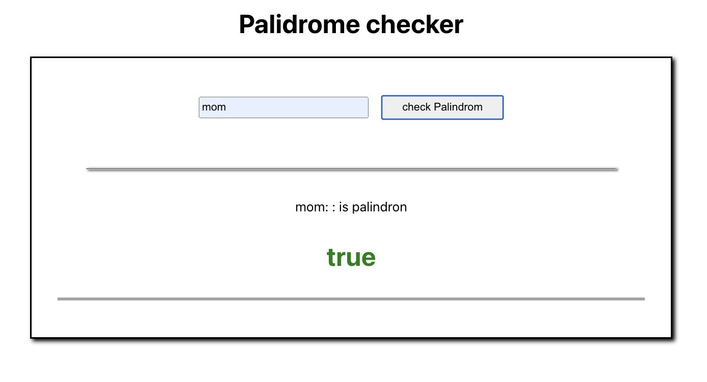

#  palindrome checker

enter a string and the system will check if its a palidrome on not, if its a palidrome its state true else false 

### Technologies

- React
- JavaScript
- HTML 
- CSS

### Screenshot

